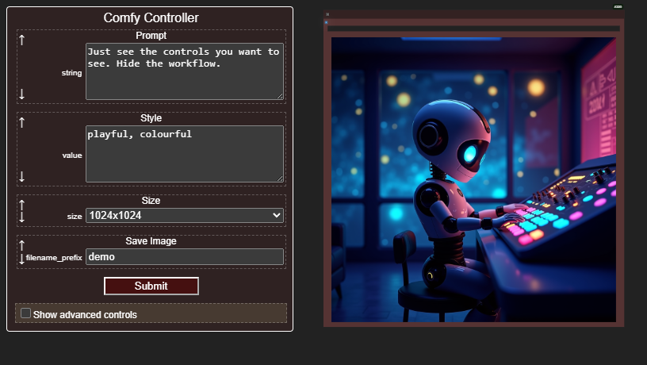
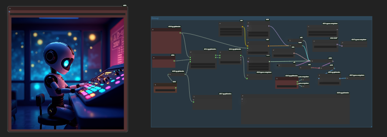

# Controller

The controller is a floating panel which reproduces widget inputs from all the red nodes in your workflow. That's pretty much it.

So you can use Comfy with it looking like this:



When the workflow really looks like this:



## How to use

- Install the custom node
```
cd custom_nodes
git clone https://github.com/chrisgoringe/cg-controller
```
- Set the nodes in your workflow you want to see the widgets from to be red
- Right-click the canvas and select 'Show Controller Panel'

## Options

In the main comfy menu there are some options:

### Toggle controller visibility

You can choose one of four keyboard shortcuts to make the controller appear or disappear, or set it to none. Default is `c`.

### Sliders

Options to replace numeric fields with slider inputs. Three choices

- `No`
- `When exact`
- `When possible`

A slider input is calibrated in 200 steps, so if the range of values divided by the precision (for floats) is greater than 200, a slider cannot be exact. `When possible` will use a slider anyway.

Lots of INT and FLOAT widgets don't have a sesnsible max. For instance, `steps` typically allows values up to 2048, which makes a slider hard to use. You can override these values by adding `name=max` to the comma separated list, where `name` is the name of the input, and `max` is the maximum value you want the slider to take. The default is `guidance=10,steps=100` which should give you a sense of how to use this.

Please suggest additional default values by raising an [issue](https://github.com/chrisgoringe/cg-controller/issues)!

## Anything else?

- You can make nodes brown to designate them as advanced controls
- If you change colors or widgets or names, use the 'Update Controller Panel' canvas menu (to be fixed  - issue #9)
- To update the controller code (if you haven't added it via the manager)
```
cd custom_nodes/cg-controller
git pull
```

## Bugs or ideas

Raise them as [issues](https://github.com/chrisgoringe/cg-controller/issues)

## Release history

### v0.4 4/10/2024

- Added keyboard shortcuts
- Added sliders

### v0.3 3/10/2024

- Updating the panel now picks up changes in widgets and colors 
- Title changes now picked up
- Node order preserved in cases where it was lost

### v0.2 3/10/2024

- Preserve height of resized text areas
- Close panel when workflow cleared
- Cleaned up the layout when multi column
- Submitted to Comfy Manager

### v0.1 2/10/2024

- Added support for Image nodes
- Added 'advanced' colour

### v0.0.9 1/10/2024

- Initial release