# Controller

The Controller is a new way to interact with a Comfy workflow, 
in which just the nodes that you select are mirrored in the Controller, 
without you needing to make any changes to the workflow itself.

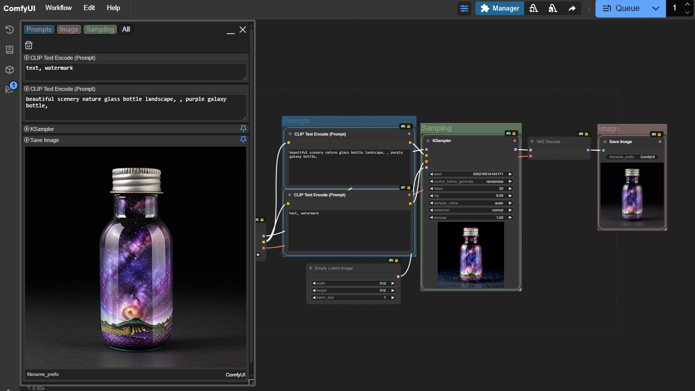

So you can lay your workflow out however makes most sense to you, 
and then bring all the nodes you want to see together in one place.
When you want to edit the workflow, it's still there, untouched.

The controller gets saved with the workflow, so once you've set it up, it's always there for you.
And if you share the workflow with someone else, they get your controller as well...

## Latest update - v1.7, 14th Feb 2025

- Added workspaces (WIP)
- Image viewers now work with batches
- Better support for some rgthree COMBO features
- Option to hide file types such as .safetensors in loader nodes (main settings)
- Option to specify that a node shouldn't show images in controller (right-click nodeblock title)

## Getting started

The Controller is toggled using a button in the top menu. When the sliders icon is blue, the Controller is active.

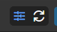

There will normally be one controller window created for you. If not, or to add more, 
right click on the background and select "New Controller" from the menu (if it isn't there, check the Controller is active!).

At first, the Controller will be empty. To add nodes to it, right-click on the node and in the Controller Panel menu select "Include this node".
You can also select multiple nodes and add them all at once.

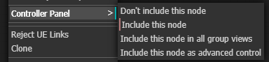

When you include a node, it appears on the Controller panel, and it also gains a coloured dot in the top-right hand corner, 
so when you look at the workflow you can easily see which nodes are included.

The node, with all standard widgets (we'll work to include the most popular custom widgets in future releases!) will now appear in the controller
as a panel with the same title and colour as the node, underneath which are all the widgets. 

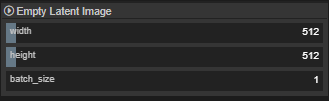

If you now edit the values in those widgets, the changes will be reflected in the workflow (and vica versa). 
Combo boxes, toggle switches, buttons, and text fields all work just as you would expect. 

### Sliders for numeric values

Numeric fields (like width in the image) a represented using an editable slider. 
Click on the slider and drag left or right, and the value will change between the minimum and maximum values.
You can also just hover the mouse over the slider and move the value up or down with your mouse scrollwheel.
To enter a precise value, double click and the slider turns into a text entry box where you can type the value you want.

If the minimum and maximum values, or the step size, aren't convenient, shift-click on the slider to change them. 
Note that changes made here will be reflected in the actual widget as well, however, if you set a value outside 
of the original limits the workflow may fail to validate on the server.

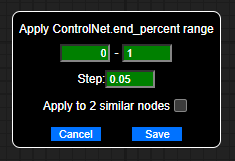

You can change the way the scrollwheel interacts with the sliders, and the keys required to edit the limits, in the main settings.

## Groups and Tabs

A new controller will show all of the selected nodes - that's what is meant by the 'All' in the top left hand corner.

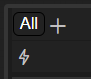

If you click on the 'All' you will get a drop down menu of all groups in the workflow 
which contain nodes that have been added to the controller. If there are added nodes that
are not in any group, you will also see the pseudo-group 'Ungrouped'. 
Select from this menu to choose the group to display.

Alternatively, you can add additional tabs, by clicking on the '+' and selecting from the same menu,
and then switch between them by clicking on the tabs (once you have multiple tabs, clicking on them
doesn't bring up the menu any more). If you want to get rid of a tab, switch to it and then click on the dustbin icon.

## The other icons

### On the controller

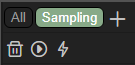

The play button indicates that all of the nodes in this group are currently active (not bypassed or muted).
You can use it to bypass or mute a group. (Mute is refered to as 'never' in some places).

Clicking the play button will bypass or unbypass the group, ctrl-clicking will mute or unmute.

|Icon|Meaning|Click will...|Ctrl-click will...|
|-|-|-|-|
|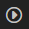|Group nodes active|Bypass group|Mute group|
|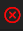|Group nodes muted|Activate group|Activate group|
|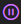|Group nodes bypassed|Activate group|Mute group|
|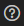|Mixed state in group|Activate group|Activate group|

The little lightning bolt icon is used to show/hide any nodes that were added as advanced controls. 
If there are no advanced control, this icon won't be shown.

### On each nodeblock

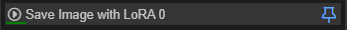

Each node can be independantly bypassed or muted using the arrow on the nodeblock.

Nodes which include an image also have a pin in the top right corner: 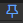
When this is active (blue, the default) the image will be shown at the full width of the controller. 
If you unpin the image, you will find a handle at the bottom right of the image that can be used to resize it (vertically).

Right-clicking the title of a nodeblock brings up options to control which widgets should be shown, and which images (if any) should be shown, in this nodeblock.

## Other things to explore

### Workspaces

WIP - you can save and then reload the setup of your controllers from the dropdown triangle 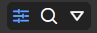. This may be useful if you use the same workflow in different ways. There are plans to make this feature more useful!

### Batches

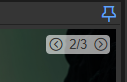

If you have a batch of images, you can click through them on the preview using the control in the top right corner.

### Mask Editor

ctrl-click or right-click on an image in the controller to bring up a context menu, from which you can launch the mask editor.

### Selectively hide widgets

ctrl-click or right-click on the title of a nodeblock and you can hide/show specific widgets. Note that hide/show is specific to the controller, 
so you can have the same node showing different widgets on different controllers if you want!

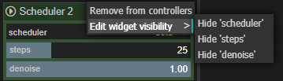

### Hover and zoom

If the magnifying glass in the top control is active -  - then when you move you mouse over a node in 
the controller it will be highlighted in the workflow, and when you move your mouse over a group tab, the group will
be highlighted.

Control-click a tab and the workflow will zoom to show the group.

### Multiple controllers

Remember, you can add more controllers any time by right clicking on the canvas. You can also close controllers with the 'X',
or minimise them with the '_'.

### Rearrange the nodes

You can rearrange the node panels in the controller by clicking on the node panel title bar and dragging it up or down.

### Collapse nodes

You can save space by collapsing the node panels, just like you can collapse nodes in the workflow. 
Click on the title bar without dragging to collapse, click it again to expand.

### Resize text and images

Multiline text fields and (unpinned) image displays can be rescaled up or down using the resize handle in the bottom right hand corner of the widget.
As you drag the height is shown as an overlay, in case you want to make things the same size.

### The workflow is still there

Any time you want to, you can go back to the workflow and work with it directly. 
The Controller is just a way of viewing it (and changing widgets values).

Some changes that you make will not be immediately reflected in the Controller (for instance, if you change the colour of a node), 
but you just need to click the refresh button (top right of the Controller) to bring it up to date.

### Settings

In the main settings menu are a few things you can tweak such as:

- hiding control_after_generate 
- keyboard shortcut to show or hide the Controller
- settings to control how you can interact with the sliders
- option to hide filename extensions

There's also a debug setting that I might ask you to use if you report a problem!

### Resize controller

There is a little drag box at the bottom right of the controller that you can use to resize it. 
You can also move it around by dragging the header.

### Snapping

Controllers will snap to each other and move around together. To break them apart, move the controller on the right or bottom.

## Supporting Custom Nodes

Custom nodes which do not add specialised widgets will generally work. Some custom nodes with custom widgets are also supported:

- [trung0246](https://github.com/Trung0246/ComfyUI-0246) switch

## Known Limitations

### Custom widgets

At present only standard Comfy widgets and some custom ones are supported. We'll be working to bring more of the more popular custom node widgets to the controller
in future releases.

# The road ahead...

For more details of what's under consideration, take a look at the [issues list](https://github.com/chrisgoringe/cg-controller/issues), 
and feel free to add your ideas there, or 
jump into the discussion [here](https://github.com/chrisgoringe/cg-controller/discussions).

# Bug reports

[Bug reports are very welcome](https://github.com/chrisgoringe/cg-controller/issues). 

It's really helpful if you include as much in the way of specific detail as possible, possibly including screenshots or copies of the workflow.
You can also press f12 and look in the javascript console to see if there are any errors with 'cg-controller' in them.

A screenshot of your Settings/About is a big help too!

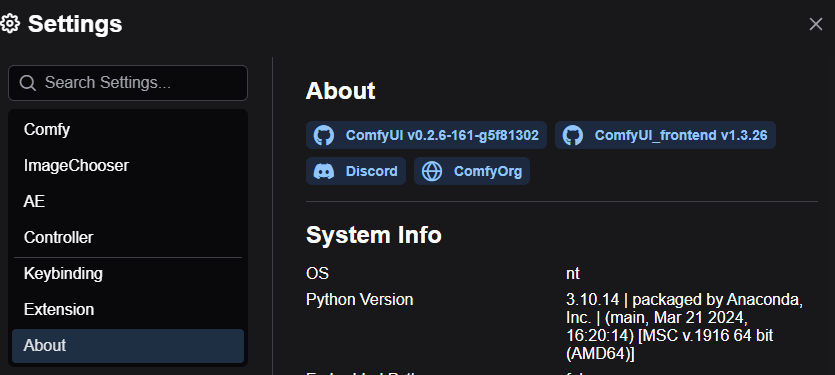

# Credits

Controller has been developed by [Chris Goringe](https://github.com/chrisgoringe). 

[JorgeR81](https://github.com/JorgeR81) has been making invaluable suggestions, testing, and UI mockups since the first alpha release, and more recently [LukeG89](https://github.com/LukeG89) has become a regular and valuable contributor to the discussions and testing.