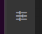
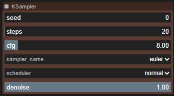
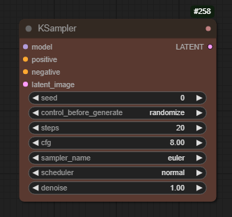
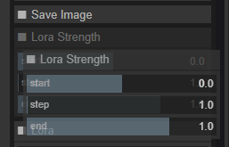
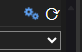
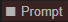
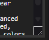
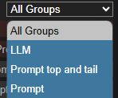

# Controller

The Controller is a new way to interact with a Comfy workflow, 
in which just the nodes that you select are mirrored in the Controller, 
without you needing to make any changes to the workflow itself.

So you can lay your workflow out however makes most sense to you, 
and then bring all the nodes you want to see together in one place.
When you want to edit the workflow, it's still there, untouched.

The controller gets saved with the workflow, so once you've set it up, it's always there for you.
And if you share the workflow with someone else, they get your controller as well...

## Getting started

The Controller is an extra sidebar tab. Like other sidebar tabs, just click it to bring the Controller into view.

At first, the Controller will be empty. To add nodes to it, right-click on the node and in the Controller Panel menu select "Include this node".

The button next to the Controller toggle is the refresh. Not all changes in the workflow are automatically picked up by the controller, 
so sometimes after you make a change you will need to click this.

When you include a node, it appears on the Controller panel, and it also gains a coloured dot in the top-right hand corner, 
so when you look at the workflow you can easily see which nodes are included.

The node, with all standard widgets (we'll work to include the most popular custom widgets in future releases!) will now appear in the controller
as a panel with the same title and colour as the node, underneath which are all the widgets. 

|Controller|Node|
|-|-|
|||
||Where is the control_before_generate? It's hidden, but you can change that in the settings|

If you now edit the values in those widgets, the changes will be reflected in the workflow (and vica versa). 
Combo boxes, toggle switches, buttons, and text fields all work just as you would expect. 

Numeric fields (like cfg in the image) a represented using an editable slider. 
Click on the slider and drag left or right, and the value will change between the minimum and maximum values.
You can also just hover the mouse over the slider and move the value up or down with your mouse scrollwheel.
To enter a precise value, double click and the slider turns into a text entry box where you can type the value you want.
If the minimum and maximum values, or the step size, aren't convenient, shift-click on the slider to change them. 
Note that changes made here will be reflected in the actual widget as well, however, if you set a value outside 
of the original limits the workflow may fail to validate on the server.

You can change the way the scrollwheel interacts with the sliders, and the keys required to edit the limits, in the main settings.

## Getting more organised

For more complex workflows, you will probably find that there are quite a few nodes that you want to be able to control. 
The controller scrolls to accomodate as many nodes as you like, but we can do better than that...

### Rearrange the nodes

You can rearrange the node panels in the controller by clicking on the node panel title bar and dragging it up or down.

### Advanced controls

If there are nodes that you only occasionally need to interact with, you can designate them as 'advanced controls' when you 
add them to the controller. Advanced controls will only be shown if the 'Advanced controls' icon (the gears in the top right hand corner) is blue, 
and the node in the workflow gets an open circle in place of the dot in the top right. The gears icon only appears if there are advanced controls to show or hide!

### Collapse nodes

You can save space by collapsing the node panels, just like you can collapse nodes in the workflow. Just click the square
at the left-hand side of the title bar, click it again to expand.

### Resize text and images

Multiline text fields and image displays can be rescaled up or down using the resize handle in the bottom right hand corner of the widget.
As you drag the height is shown as an overlay, in case you want to make things the same size.

### Selecting groups

If you've build a complex workflow you've probably used groups to help you organise the nodes. 
Using the drop-down menu at the top of the controller you can choose to just see the nodes in a single group.
So you can quickly flick between the controls for your prompt, your controlnet, your upscaling...

And if you want a node to be visible whatever group is selected, just add it with the 'Include this node in all group views' setting.

## Other cool things

### The workflow is still there

Any time you want to, you can go back to the workflow and work with it directly. 
The Controller is just a way of viewing it (and changing widgets values).

Some changes that you make will not be immediately reflected in the Controller (for instance, if you change the colour of a node), 
but you just need to click the refresh button (top right of the Controller) to bring it up to date.

### Images

The Controller works with Load, Save and Preview image nodes, as well as the image previews shown on the sampler node.

### Settings

In the main settings menu are a few things you can tweak - hiding control_after_generate, a keyboard shortcut to show or hide the Controller,
and settings to control how you can interact with the sliders.

There's also a debug setting that I might ask you to use if you report a problem!

### Controller width

There is a little drag box at the bottom right of the controller that you can use to make it narrower or wider. 
Its width is independant of the other sidebar controls.

## Known Limitations

### Custom widgets

At present only standard Comfy widgets are supported. We'll be working to bring some of the more popular custom node widgets to the controller
in future releases, probably starting with rgthree's Power Lora Loader.

# The road ahead...

Future features will depend on community feedback, but some of the top contenders right now are...

- Visual links between the controller and workflow (click a workflow group to select it in the controller)
- Toggling node and group bypass from the controller
- Multiple controller columns
- Multiple group selection

For more details of what's under consideration, take a look [here](https://github.com/chrisgoringe/cg-controller/milestone/21), 
and jump into the discussion [here](https://github.com/chrisgoringe/cg-controller/discussions/210).

[Bug reports or feature requests very welcome](https://github.com/chrisgoringe/cg-controller/issues)

# Credits

Controller has been developed by [Chris Goringe](https://github.com/chrisgoringe). 

[JorgeR81](https://github.com/JorgeR81) has been making invaluable suggestions, testing, and UI mockups since the first alpha release, and more recently [LukeG89](https://github.com/LukeG89) has become a regular and valuable contributor to the discussions and testing.