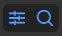
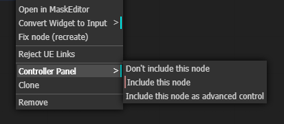

# Controller

The Controller is a new way to interact with a Comfy workflow, 
in which just the nodes that you select are mirrored in the Controller, 
without you needing to make any changes to the workflow itself.

So you can lay your workflow out however makes most sense to you, 
and then bring all the nodes you want to see together in one place.
When you want to edit the workflow, it's still there, untouched.

The controller gets saved with the workflow, so once you've set it up, it's always there for you.
And if you share the workflow with someone else, they get your controller as well...

## Getting started

The Controller is toggled using a button in the top menu. When the sliders icon is blue, the Controller is active.

To create a Controller window, right click on the background and select "New Controller" from the menu (if it isn't there, check the Controller is active!).

At first, the Controller will be empty. To add nodes to it, right-click on the node and in the Controller Panel menu select "Include this node".

When you include a node, it appears on the Controller panel, and it also gains a coloured dot in the top-right hand corner, 
so when you look at the workflow you can easily see which nodes are included.

The node, with all standard widgets (we'll work to include the most popular custom widgets in future releases!) will now appear in the controller
as a panel with the same title and colour as the node, underneath which are all the widgets. 

|Controller|Node|
|-|-|
|||
||Where is the control_before_generate? It's hidden, but you can change that in the settings|

If you now edit the values in those widgets, the changes will be reflected in the workflow (and vica versa). 
Combo boxes, toggle switches, buttons, and text fields all work just as you would expect. 

Numeric fields (like cfg in the image) a represented using an editable slider. 
Click on the slider and drag left or right, and the value will change between the minimum and maximum values.
You can also just hover the mouse over the slider and move the value up or down with your mouse scrollwheel.
To enter a precise value, double click and the slider turns into a text entry box where you can type the value you want.
If the minimum and maximum values, or the step size, aren't convenient, shift-click on the slider to change them. 
Note that changes made here will be reflected in the actual widget as well, however, if you set a value outside 
of the original limits the workflow may fail to validate on the server.

You can change the way the scrollwheel interacts with the sliders, and the keys required to edit the limits, in the main settings.

## Groups and Tabs

A new controller will show all of the selected nodes - that's what is meant by the 'All' in the top left hand corner.

If you click on the 'All' you will get a drop down menu of all groups in the workflow 
which contain nodes that have been added to the controller. If there are added nodes that
are not in any group, you will also see the pseudo-group 'Ungrouped'. 
Select from this menu to choose the group to display.

Alternatively, you can add additional tabs, by clicking on the '+' and selecting from the same menu,
and then switch between them by clicking on the tabs (once you have multiple tabs, clicking on them
doesn't bring up the menu any more). If you want to get rid of a tab, switch to it and then click on the dustbin icon.

## The other icons

The little lightning bolt icon is used to show/hide any nodes that were added as advanced controls. 
If there are no advanced control, this icon won't be shown.

The no-entry sign (circle with slash) is a placeholder - in a forthcoming release it will be
used to toggle the group between active and bypassed.

In the top right there is a minimise button, and a close button which can be used to minimise or close
this controller window. A minimised controller just shows the tab name and the 'X':

click the tab name to restore the controller to full size.

## Other things to explore

### Rearrange the nodes

You can rearrange the node panels in the controller by clicking on the node panel title bar and dragging it up or down.

### Collapse nodes

You can save space by collapsing the node panels, just like you can collapse nodes in the workflow. Just click the square
at the left-hand side of the title bar, click it again to expand.

### Resize text and images

Multiline text fields and image displays can be rescaled up or down using the resize handle in the bottom right hand corner of the widget.
As you drag the height is shown as an overlay, in case you want to make things the same size.

### The workflow is still there

Any time you want to, you can go back to the workflow and work with it directly. 
The Controller is just a way of viewing it (and changing widgets values).

Some changes that you make will not be immediately reflected in the Controller (for instance, if you change the colour of a node), 
but you just need to click the refresh button (top right of the Controller) to bring it up to date.

### Images

The Controller works with Load, Save and Preview image nodes. The image preview nodes also show the interim images shown in the sampler, if you
have that feature turned on.

### Settings

In the main settings menu are a few things you can tweak - hiding control_after_generate, a keyboard shortcut to show or hide the Controller,
and settings to control how you can interact with the sliders.

There's also a debug setting that I might ask you to use if you report a problem!

### Resize controller

There is a little drag box at the bottom right of the controller that you can use to resize it. 
You can also move it around by dragging the header.

## Known Limitations

### Custom widgets

At present only standard Comfy widgets are supported. We'll be working to bring some of the more popular custom node widgets to the controller
in future releases, probably starting with rgthree's Power Lora Loader.

# The road ahead...

Future features will depend on community feedback, but some of the top contenders right now are...

- Visual links between the controller and workflow (highlight node on hover)
- Toggling bypass 
- Selecting which widgets on a node to show

For more details of what's under consideration, take a look at the [issues list](https://github.com/chrisgoringe/cg-controller/issues), 
and feel free to add your ideas there, or 
jump into the discussion [here](https://github.com/chrisgoringe/cg-controller/discussions/210).

# Bug reports

[Bug reports are very welcome](https://github.com/chrisgoringe/cg-controller/issues). 

It's really helpful if you include as much in the way of specific detail as possible, possibly including screenshots or copies of the workflow.
You can also press f12 and look in the javascript console to see if there are any errors with 'cg-controller' in them.

A screenshot of your Settings/About is a big help too!

# Credits

Controller has been developed by [Chris Goringe](https://github.com/chrisgoringe). 

[JorgeR81](https://github.com/JorgeR81) has been making invaluable suggestions, testing, and UI mockups since the first alpha release, and more recently [LukeG89](https://github.com/LukeG89) has become a regular and valuable contributor to the discussions and testing.